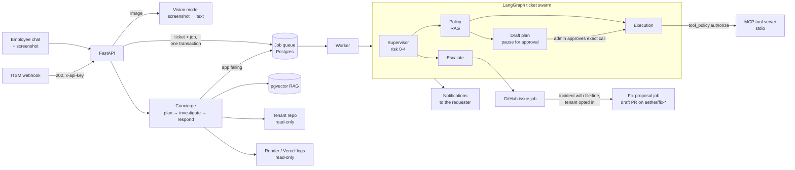
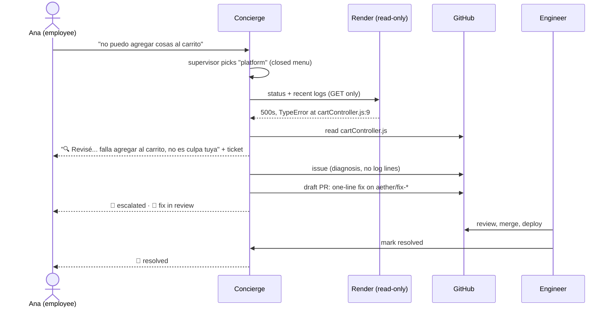

# Aether ITSM

Multi-tenant IT support agents whose safety does not depend on the model behaving.

Employees describe a problem in a chat (optionally with a screenshot) or an ITSM platform
sends a ticket by webhook. In the chat, a supervisor decides what to look at — even when
the user writes "no puedo agregar cosas al carrito" and nothing technical — reads the
company app's status and logs read-only, follows the stack trace to the failing line, and
either answers or hands it to engineering with the diagnosis, a GitHub issue and, if the
tenant opts in, a draft pull request with a proposed fix; the user is notified as it moves.
A LangGraph agent swarm classifies tickets' risk, checks company policy, and either resolves
them with a tool call, pauses for a human to approve an exact action, or escalates. Every
decision that matters is made in code: the model proposes, deterministic policy decides.

> Status of every claim in `docs/` is marked **Implemented / Partial / Planned**. Some
> parts of the original design (OpenShell sandbox, ITSM write-back, Nemotron on Nebius)
> are not built yet, and the VPN/MDM/IAM tool backends are simulated. See
> [What is real](#what-is-real-today).

## Architecture



### A non-technical report, end to end (Fase 16, verified live)



Key design choices:

- **Deterministic guardrails.** Risk floors (`src/agents/ticket_flow/risk_policy.py`) and a default-deny
  per-tool policy (`src/tools/tool_policy.py`) can only raise risk, bind identity arguments
  to the requester, validate arguments and block SSRF. A risk-3 action is frozen at plan
  time and runs exactly as approved, with no LLM in between.
- **Untrusted input stays data.** RAG chunks, repo files, logs, tool output and screenshot
  text are redacted and fenced (`src/security/prompt_safety.py`); the prompt budget keeps the
  system prompt from being truncated away (`src/llm/context_budget.py`).
- **Screenshots → text.** A vision model reads an attached image once (visible error text
  verbatim + a short description); the text-only agents get that text, so risk floors, RAG
  and "read the file from the stack trace" all keep working (`src/agents/runtime/vision.py`).
- **Durable work.** A job queue in the same database (transactional outbox, retries,
  heartbeat, dead-letter, crash-resume from the last LangGraph checkpoint), no Redis.
- **The model chooses what to read, never with what.** The chat supervisor picks checks from
  a closed menu; service names, file paths and search text are validated against the tenant's
  configuration and the real repo tree; the regex floor can't be removed
  (`src/agents/concierge/plan.py`). Fix proposals are a single validated edit, written only
  to new `aether/fix-*` branches as draft PRs (`src/agents/code_fix/`).
- **Measured.** An eval harness on the real graph (`evals/`) — including a diagnosis suite on
  the real test-app repo with Render-shaped logs — per-node/per-call tracing with tokens and
  cost (`agent_spans`), and a red-team script against the real local models.

## Quick start

### Docker (everything)

```bash
cp .env.example .env
python gen_key.py            # appends ENCRYPTION_KEY to .env
# edit .env: JWT_SECRET_KEY, SUPERADMIN_PASSWORD
docker compose up --build    # → http://localhost:8080  (API on :8000)
```

Postgres + pgvector, the API (migrations run on start, embedded worker) and the web app
behind nginx. Models are served by Ollama on the host by default — pull them first:

```bash
ollama pull llama3.2:1b && ollama pull llama3.1:8b && ollama pull nomic-embed-text && ollama pull qwen2.5vl:3b
```

or run Ollama in a container: `OLLAMA_HOST=http://ollama:11434 docker compose --profile ollama up --build`.

Sign in as `admin@aether.ai` with `SUPERADMIN_PASSWORD`.

### Local development

```bash
python -m venv .venv && source .venv/bin/activate    # Windows: .venv\Scripts\activate
pip install -r requirements-dev.txt
python -m src.db.migrate                             # SQLite app.db unless DATABASE_URL is set
uvicorn src.main:app --reload --port 8000
cd frontend && npm install && npm run dev            # http://localhost:5173
```

## Testing

| Command | What it checks |
| :-- | :-- |
| `pytest -q` | ~340 tests: graph, queue, security findings, tool policy, migrations, vision, chat supervisor, incident → fix → notification cycle — scripted models, no network |
| `ruff check .` · `mypy` | lint; types for `src/agents`, `src/llm`, `src/prompts`, `src/tools`, `src/core`, `src/security` and the retrieval modules of `src/rag` |
| `lint-imports` | the layer contract below: no module imports a layer above its own |
| `RLS_TEST_DATABASE_URL=… pytest tests/test_rls_postgres.py` | Row-Level Security on a real Postgres |
| `python -m evals.run --suite all --fail-under unsafe_actions_max=0` | 42 tickets + 10 chat turns + 34 diagnosis conversations on the real models; unsafe actions must be 0 |
| `python -m evals.rag.run --database-url <disposable pg>` | RAG retrieval eval: 74 queries over a 16-document, 2-tenant corpus (hit@k, MRR, nDCG, "no answer", tenant leaks) |
| `python scripts/redteam_ollama.py` | prompt-injection / privilege attacks against the real local models |

CI (`.github/workflows/ci.yml`) runs lint, types, tests, migrations + `alembic check` and the
RLS suite on Postgres, the frontend lint/type-check/build, and both Docker builds.

## What is real today

| Area | Status |
| :-- | :-- |
| Agent graph, risk floors, tool policy, human gate, escalation to GitHub | Implemented |
| Employee chat: RAG, repo reading, read-only platform logs, screenshot reading | Implemented |
| Chat supervisor that decides what to investigate (non-technical wording), second round to follow a lead | Implemented — `evals --suite diagnosis`: non-technical recall 0.10 → 1.00 |
| Incident → engineering → draft fix PR → in-app notifications | Implemented — verified live against Render + GitHub (Fase 16.9); fixes need human review |
| RAG: hybrid search (pgvector HNSW + BM25 + exact identifiers), cross-encoder reranking, follow-up rewriting, cited sources, versioned async indexing, RLS on retrieval | Implemented — measured with `evals/rag` (hit@5 0.78 → 0.98) |
| Job queue, tracing/usage, evals, migrations, Docker, CI | Implemented |
| Row-Level Security | Implemented and tested; enabled per deployment (`DB_RLS_ENABLED`) |
| MCP tools `reset_vpn_session`, `provision_standard_software`, `modify_iam_access`, `query_knowledge_base` | Real protocol, **simulated backends** |
| ITSM write-back (comment/resolve in Jira/ServiceNow), Slack/Teams | Planned |
| OpenShell sandbox for tools, Nebius-hosted models | Planned |
| Streaming responses, conversation history | Planned (roadmap §3) |

## Repository map

The backend is layered; each package may import only from its own layer or the ones below it
(enforced by `lint-imports`, see `[tool.importlinter]` in `pyproject.toml`):

```
src/main.py src/worker.py   entrypoints: create_app() for uvicorn, standalone job worker (python -m src.worker)
src/api/                    deps (DI), routers/ per resource, schemas/ (request/response models), errors
src/services/               use cases: tickets, ticket runs, chat, auth, users, tenant, job registry
src/agents/
  ticket_flow/              LangGraph graph, state, risk policy, nodes/ (supervisor, policy, execution, draft_plan, escalate)
  concierge/                employee chat agent: turn, repo access, platform logs, reply
  runtime/                  checkpointer, message helpers, vision (screenshots -> text)
src/tools/ src/prompts/     MCP server + client and tool policy; prompt templates
src/rag/ src/integrations/  retrieval pipeline; GitHub, read-only Render/Vercel logs (platform_logs/)
src/llm/                    model factory, structured output, context budget
src/jobs/ src/observability/  durable DB queue; spans, usage, request/trace ids
src/db/ src/security/       models, migrations runner, Row-Level Security; redaction, fences, URL guard
src/core/ src/utils/        settings; small shared helpers
migrations/                 Alembic revisions
evals/ scripts/             evaluation harness, E2E and red-team scripts
frontend/                   React + Vite + Tailwind
docs/                       architecture, security guardrails, ADRs, specs, roadmap
```

## Documentation

- [Security guardrails & LLM threat model](docs/security_guardrails.md)
- [Architecture](docs/architecture.md) · [ADRs](docs/adrs/)
- [Evaluation](docs/specs/evaluation_metrics.md) · [MCP tool registry](docs/specs/mcp_registry.md)
- [Runbook](docs/specs/runbook.md) · [Roadmap](docs/ROADMAP_NEXT_LEVEL.md)
- Implementation log, phase by phase: [docs/PLAN_IMPLEMENTACION.txt](docs/PLAN_IMPLEMENTACION.txt)
