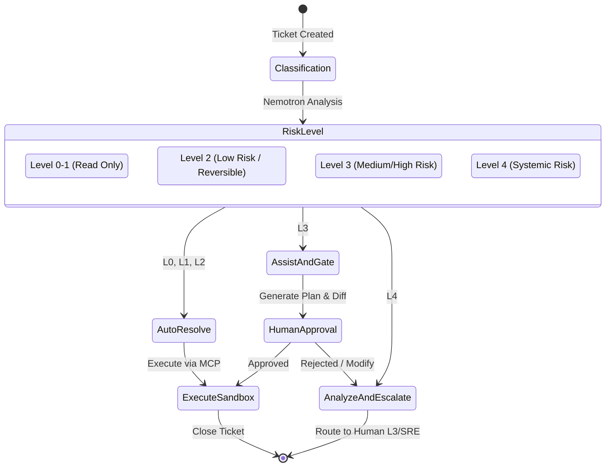
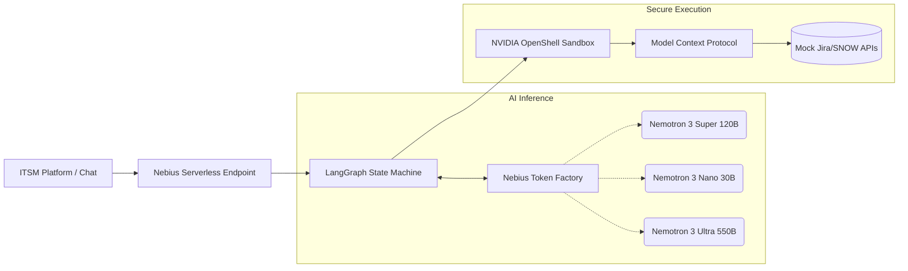

# Product Requirements & Architecture Document (PRAD)
**Project Name:** Aether ITSM  
**Hackathon Target:** Nebius x NVIDIA Global AI Hackathon (Best Apps & Agents Track)

---

## 1. Executive Summary

Aether ITSM is an enterprise-grade IT/DevOps support agent designed to resolve the single largest bottleneck in modern IT Service Management (ITSM): Tier 1 (L1) support overhead. 

Rather than a generalized coding assistant, Aether is a targeted business application. It leverages the **NVIDIA Nemotron 3** model family running on **Nebius Token Factory** to automate repetitive requests (access, VPN, standard software provisioning) while applying stringent, zero-trust security guardrails via **NVIDIA OpenShell** and the **Model Context Protocol (MCP)**. 

Aether's core value proposition is its **"Autonomy Cascade"**—a deterministic state machine that mathematically restricts agent capabilities based on the assessed risk of the ticket, ensuring that AI never breaks production.

---

## 2. Market Opportunity & Business Logic

### 2.1 The L1 Helpdesk Bottleneck
The market for AI and automation in IT support is experiencing hyper-growth:
*   **Total Addressable Market (TAM):** Projected to grow from ~$26.38B USD (2024) to **~$210.86B USD by 2032** (~29.7% CAGR).
*   **Helpdesk Automation Segment:** Estimated to reach **$40.76B USD by 2031**.

**The Enterprise Pain Point:**
Service desks are drowning in repetitive "noise" (password resets, VPN connectivity, basic permissions). Studies indicate that AI implementations in this specific tier achieve:
*   **40–60% ticket deflection** (resolved without human intervention).
*   **30–50% reduction in cost per ticket.**
*   **35–52% reduction in Mean Time To Resolution (MTTR).**

Aether's explicit goal is to capture this deflection rate by optimizing L1, thereby freeing human SREs and DevOps engineers for high-value operations.

### 2.2 ITSM Ecosystem Integration
Aether is designed to act as an invisible intelligence layer on top of industry-standard platforms:
*   **ServiceNow:** (~44.4% market share, dominant in Enterprise).
*   **Jira Service Management:** (dominant in mid-market and DevOps-centric organizations).

**Key Stakeholders:**
*   **Buyers:** CIOs, Heads of IT, Directors of Enterprise Support.
*   **Users:** L1/L2 Agents (as copilots), SREs, and End Employees.

---

## 3. The "Autonomy Cascade" Model

The literature on Agentic AIOps is clear: an agent must not have *carte blanche* to edit critical infrastructure. Aether implements a strict, policy-driven risk cascade based on SOC/AIOps best practices.

### 3.1 Step 1: Incident Classification (Reasoning Phase)
Upon receiving a ticket, Aether (powered by Nemotron Nano/Super) executes a pure reasoning pass:
1.  **Classify Intent:** (e.g., VPN, Software Installation, Database Outage).
2.  **Estimate Blast Radius:** Does this affect one user, a dev environment, or a critical production service?
3.  **Identify Tooling:** Determine which MCP tools (APIs, scripts) are required.
> *No execution occurs in this step.*

### 3.2 Step 2 & 3: Risk Assignment and Routing Flow

#### Detailed Risk Tiers:
*   **Level 0–1 (Observation):** Purely read-only. The agent consults service statuses, reads logs, and summarizes incidents. **Action:** 100% Autonomous.
*   **Level 2 (Low Risk):** Reversible actions. Examples: restarting a non-critical dev service, clearing user caches. **Action:** 100% Autonomous execution within a sandbox.
*   **Level 3 (Medium/High Risk but Contained):** Examples: Credential resets, access group modifications, restarting production services. **Action:** *Human-in-the-loop*. The agent generates a deployment plan/diff and waits for explicit L2/L3 approval before execution.
*   **Level 4 (Systemic Risk):** Examples: Large migrations, firewall modifications, DB schema changes. **Action:** *Analyst Mode*. The agent correlates logs and proposes mitigations but is technically blocked from executing commands.

---

## 4. Technical Architecture

Aether leverages a state-of-the-art AI stack optimized for enterprise security and throughput.

### 4.1 Inference Engine (NVIDIA Nemotron 3)
*   **Nemotron 3 Super 120B (A12B):** Used as the primary engine for L1/L2 workflow execution. Its Hybrid Mamba-Transformer architecture provides 1M token context with high throughput (ideal for RAG over large knowledge bases).
*   **Nemotron 3 Nano 30B:** Used for ultra-low latency tasks: rapid ticket classification and simple conversational responses.
*   **Nemotron 3 Ultra:** Reserved strictly for deep reasoning on Level 4 escalations (e.g., complex log analysis).

### 4.2 Infrastructure (Nebius AI Cloud)
*   **Nebius Token Factory:** Provides the OpenAI-compatible API for Nemotron models, ensuring high uptime and zero-retention (crucial for enterprise privacy).
*   **Nebius Serverless Endpoints:** Hosts the FastAPI backend, providing elastic scaling for incoming ticket webhooks.
*   **Nebius Serverless Jobs:** Handles asynchronous, background workloads like ETL for historical logs and re-indexing the knowledge base.

### 4.3 Agent Security (OpenShell + MCP)
*   **NVIDIA OpenShell:** Provides a kernel-level `deny-by-default` sandbox. The agent is physically blocked from accessing systems outside of explicitly defined policies.
*   **Model Context Protocol (MCP):** Standardizes tool exposure. Each tool (e.g., VPN reset script) carries metadata defining its capabilities and required trust level.

---

## 5. Development Roadmap

### Fase 0 – Discovery & Logic (Current Phase)
*   Map L1/L2 ticket types, involved systems, and risk matrices.
*   Define hardcoded policies: what is automated, what is gated, what is prohibited.

### Fase 1 – Hackathon MVP (Best Apps & Agents Track)
*   **Scope:** Implement 2–3 auto-resolvable L1 flows (Password, VPN, Standard Software).
*   **Core Tech:** LangGraph orchestration routing to Nemotron Nano/Super via Nebius.
*   **Security:** OpenShell sandbox with MCP for controlled tools.
*   **Deliverable:** A demo showcasing MTTR reduction, efficient token usage, and the safety of the Autonomy Cascade.

### Fase 2 – Post-Hackathon Pilot
*   Expand the workflow catalog.
*   Deep integration with live ServiceNow/Jira APIs.
*   Dashboarding for deflection metrics, MTTR tracking, and guardrail auditing.

### Fase 3 – SaaS Productization
*   Multi-tenant architecture on Nebius.
*   Admin panel for per-client policy configuration.
*   Commercial narrative built on verifiable metrics and the robust security posture (Nemotron + Nebius + OpenShell/MCP).
