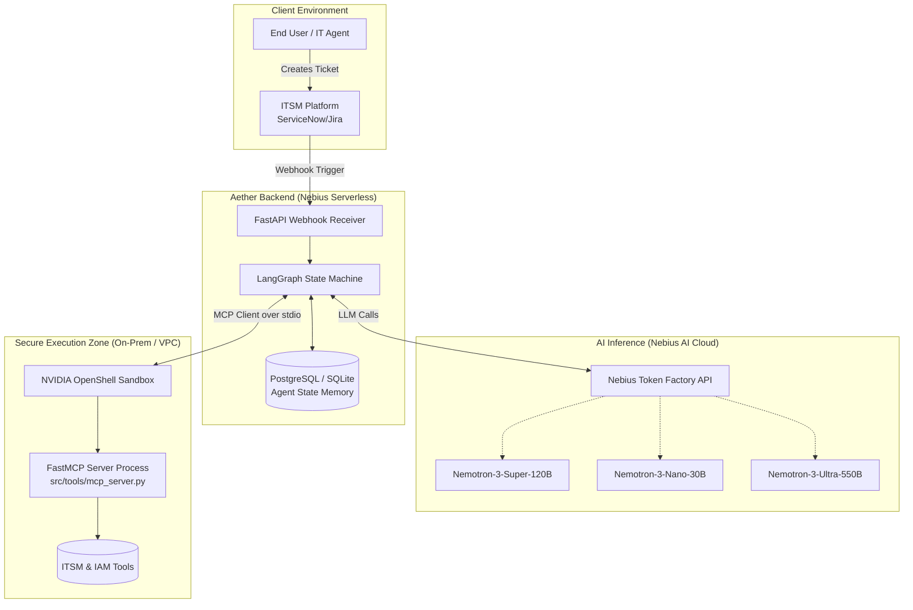
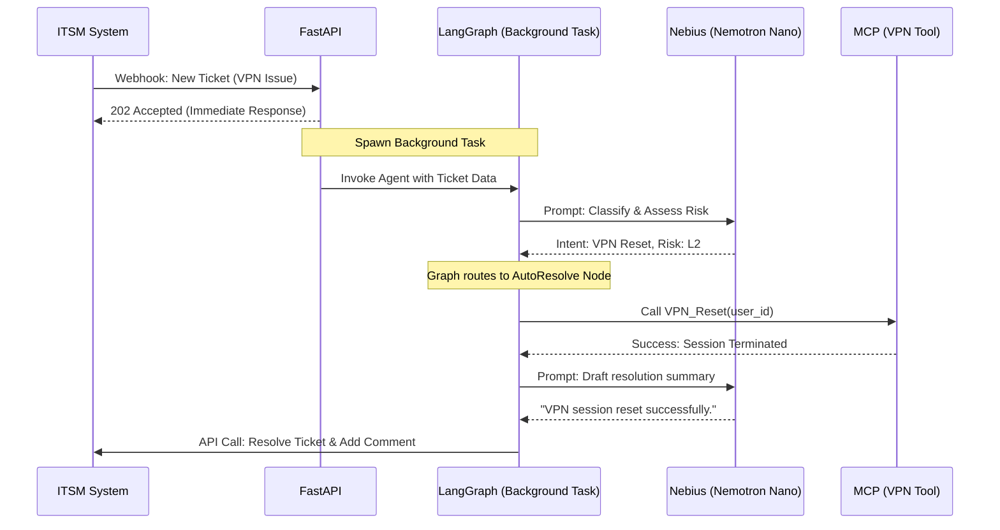
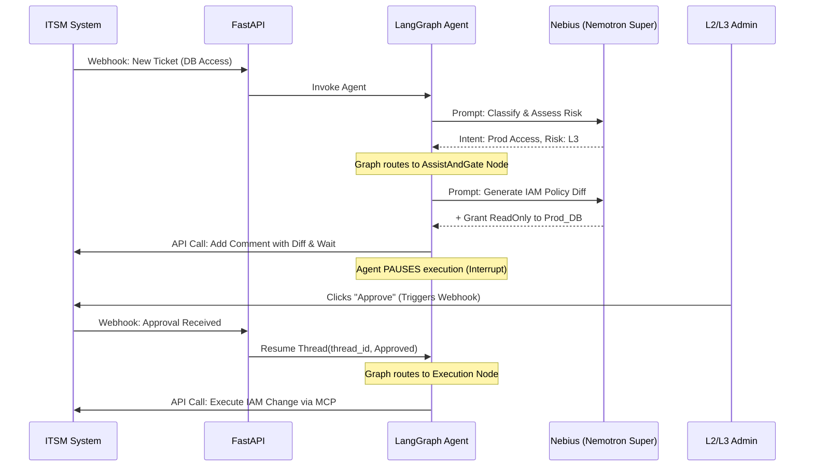

# System Architecture & Technical Flow (Aether ITSM)

## 1. Introduction
This document defines the technical architecture, component interactions, and data flows for Aether ITSM. It serves as the blueprint for development, ensuring all engineering efforts align with the "Autonomy Cascade" security model and utilize the Nebius Token Factory ecosystem effectively.

## 2. High-Level System Architecture

Aether operates as an intelligent middleware layer between the ITSM Platform (e.g., ServiceNow/Jira) and the organization's infrastructure.



## 3. Detailed Data Flows

### 3.1 Scenario A: Low-Risk Auto-Resolution (Level 2)
*Example: A user requests a VPN session reset.*



### 3.2 Scenario B: Medium-Risk Human-in-the-Loop (Level 3)
*Example: A user requests elevated access to a production database.*



## 4. LangGraph Node Specification

To achieve deterministic routing, we use LangGraph. The agent's memory (Thread State) is passed sequentially between nodes and persisted using `SqliteSaver` to survive server restarts during Human-in-the-Loop pauses.

### 4.1 State Definition (Python / Pydantic)
```python
class AgentState(TypedDict):
    messages: Annotated[Sequence[BaseMessage], operator.add]
    ticket_id: str
    user_context: dict
    assessed_risk: int  # 0 to 4
    proposed_plan: Optional[str]
    human_approved: bool
```

### 4.2 Core Nodes
Implemented node names (`src/agent/nodes.py`, `src/agent/graph.py`) differ slightly from the original naming above — this reflects the actual graph:
1.  **`supervisor` node:** Calls the "nano" model. Reads the ticket and assigns `assessed_risk` (0-4), then `enforce_risk_floor()` (`src/agent/risk_policy.py`) raises it further if the text matches a hardcoded high-risk pattern (IAM, production DB, firewall) — this floor exists precisely because the model's own classification isn't trusted as the final word. Routes to `policy`, `execution`, or `escalate`.
2.  **`policy` node:** Reached for Risk 1-3. Calls the "super" model against the tenant's `company_policy` RAG documents to decide `is_compliant`. Routes to `execution` (Risk 0-2, compliant), `draft_plan` (Risk 3, compliant), or `escalate` (non-compliant).
3.  **`execution` node:** Reached for Risk 0-2, or after a Risk 3 plan is approved. Calls the "super" model against `technical_repo`/`ai_feedback` RAG, and dispatches a real tool call through the MCP client (`src/agent/mcp_client.py`) when `tool_name` is set in its structured output — never free-form code, never a narrated-only "as if" execution.
4.  **`draft_plan` node:** Reached for Risk 3 (compliant). Drafts `proposed_plan` and the graph pauses (`interrupt_after=["draft_plan"]`) until `POST /api/approve/{ticket_id}` resumes it. On approval it proceeds to `execution` with the approved plan in context; on rejection it routes to `escalate` instead of dead-ending.
5.  **`escalate` node:** Reached for Risk 4, non-compliant requests, a rejected plan, or any node-level technical failure. Produces the escalation summary; the orchestration layer (`src/api/routes.py`, not the graph itself) then creates a GitHub Issue for the engineering team if the tenant has GitHub configured (`src/integrations/github.py`) and records the link on the ticket.

There is no `human_interrupt_node` as a separate graph node — the pause is `interrupt_after` on `draft_plan` itself, and no Nemotron-Ultra / deep-log-analysis step exists yet for `escalate`; it's the same "super" model doing what `policy`/`execution` do.

## 5. Security & Infrastructure Deployment

### 5.1 Nebius Token Factory Routing
We will use the OpenAI-compatible SDK to interact with Nebius.
*   **Base URL:** `https://api.studio.nebius.ai/v1/`
*   Model routing is handled at the LangGraph node level by passing different `model_name` strings depending on the required cognitive load.

### 5.2 NVIDIA OpenShell & FastMCP
**Implemented today:** all tools are hosted by a standalone MCP server (`src/tools/mcp_server.py`, built on `mcp.server.mcpserver.MCPServer` — the `mcp>=2.0` successor to the older `FastMCP` class). LangGraph does not import these tools directly; `src/agent/mcp_client.py` connects to the server as an MCP client over `stdio`, one long-lived connection per app process (opened in FastAPI's `lifespan`, see `src/main.py`), not spawned per ticket.

**Not implemented yet:** the OpenShell sandboxing described below. The server process today is a plain local subprocess with no network/filesystem/process isolation enforced — see `docs/security_guardrails.md` §3.1 for the current risk assessment of that gap.
*   **Process Isolation:** MCP server runs as an independent subprocess (true today — but "independent" ≠ "sandboxed"; it can still make arbitrary syscalls).
*   **Network Policy (target, not enforced):** Only allow outbound connections to specifically whitelisted internal APIs (e.g., Jira, internal AD).
*   **Filesystem Policy (target, not enforced):** Read-only access to `/etc/configs`, ephemeral read/write to `/tmp/agent_workspace`.
