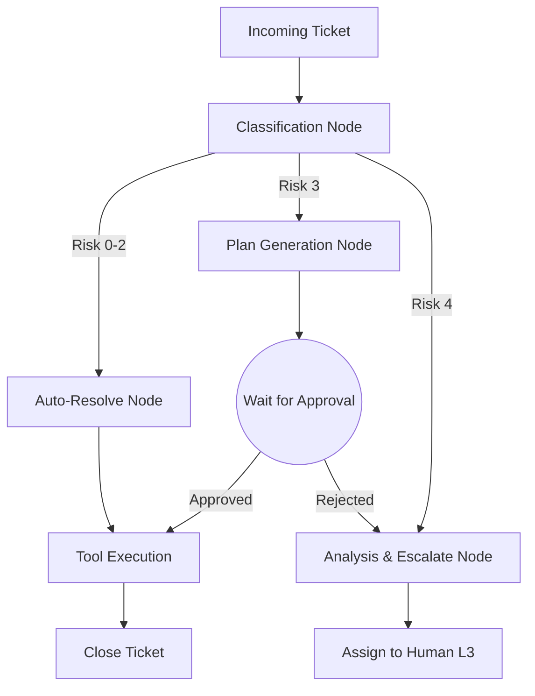

# Architecture Specification: ITSM Support Agent

## 1. Overview
This document describes the architecture for the AI-powered IT Support Agent designed to automate L1 support tasks and assist with L2/L3 operations, built for the Nebius x NVIDIA Global AI Hackathon.

## 2. Core Components

### 2.1 Inference Backend (Nebius Token Factory)
- **Primary Model (Reasoning/Orchestration):** `nvidia/Nemotron-3-Super-120B-Instruct`
- **Fast Routing Model:** `nvidia/Nemotron-3-Nano-30B-Instruct`
- **Deep Analysis (Escalation):** `nvidia/Nemotron-3-Ultra`

### 2.2 Agent Orchestration (LangGraph)
The agent operates as a state machine:
1. **Classification Node:** Receives incoming ticket/message. Determines intent and assigns a Risk Level (0-4).
2. **Execution Nodes (Risk 0-2):** Fully autonomous tool execution (e.g., reset VPN).
3. **Assist & Gate Node (Risk 3):** Generates a proposed plan, pauses execution, and waits for a human API approval.
4. **Escalate Node (Risk 4):** Summarizes the problem and passes it to L3 without execution.

### 2.3 Tools & Capabilities (MCP Inspired)
Capabilities are modularized in `src/tools/`:
- `ITSM Tool`: Read/Write mock Jira/ServiceNow tickets.
- `Access Tool`: Mock VPN/IAM changes.
- `Knowledge Base Tool`: RAG over documentation.

### 2.4 API Layer (FastAPI)
- `POST /api/chat`: Accepts messages and returns streaming or standard responses.
- `POST /api/approve/{thread_id}`: Unblocks a paused LangGraph thread (Risk 3 Human-in-the-loop).

## 3. The "Autonomy Cascade" State Graph

