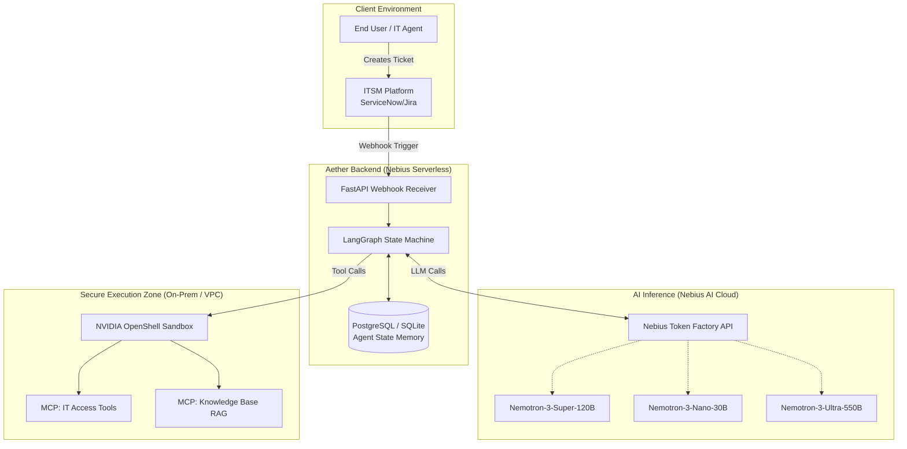
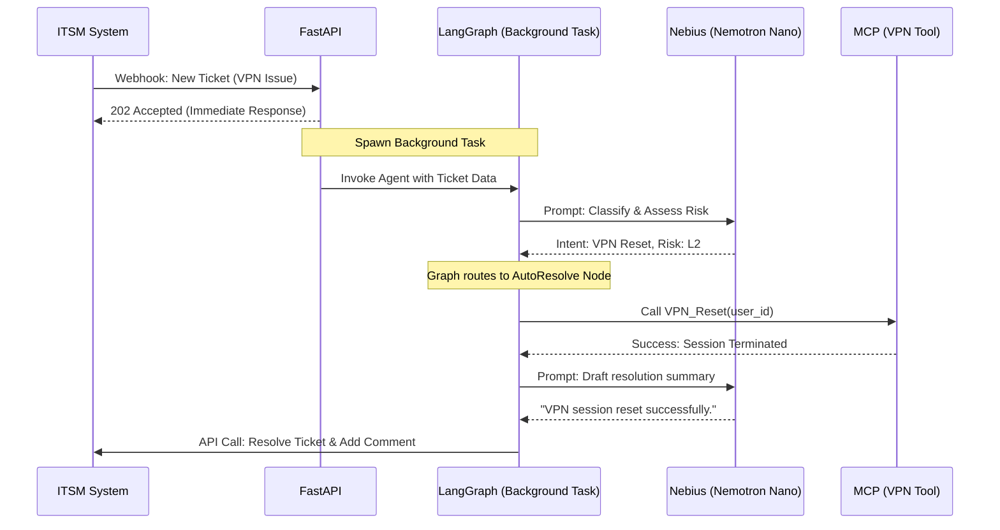
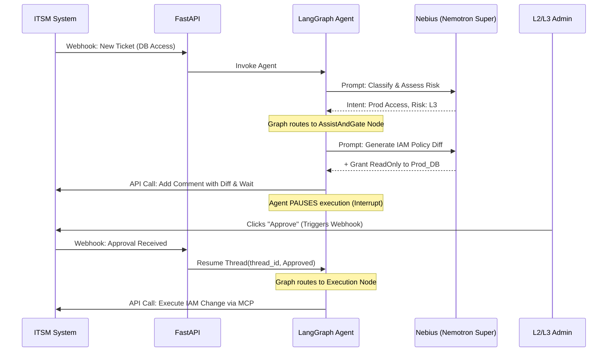

# System Architecture & Technical Flow (Aether ITSM)

## 1. Introduction
This document defines the technical architecture, component interactions, and data flows for Aether ITSM. It serves as the blueprint for development, ensuring all engineering efforts align with the "Autonomy Cascade" security model and utilize the Nebius Token Factory ecosystem effectively.

## 2. High-Level System Architecture

Aether operates as an intelligent middleware layer between the ITSM Platform (e.g., ServiceNow/Jira) and the organization's infrastructure.



## 3. Detailed Data Flows

### 3.1 Scenario A: Low-Risk Auto-Resolution (Level 2)
*Example: A user requests a VPN session reset.*



### 3.2 Scenario B: Medium-Risk Human-in-the-Loop (Level 3)
*Example: A user requests elevated access to a production database.*



## 4. LangGraph Node Specification

To achieve deterministic routing, we use LangGraph. The agent's memory (Thread State) is passed sequentially between nodes and persisted using `SqliteSaver` to survive server restarts during Human-in-the-Loop pauses.

### 4.1 State Definition (Python / Pydantic)
```python
class AgentState(TypedDict):
    messages: Annotated[Sequence[BaseMessage], operator.add]
    ticket_id: str
    user_context: dict
    assessed_risk: int  # 0 to 4
    proposed_plan: Optional[str]
    human_approved: bool
```

### 4.2 Core Nodes
1.  **`classify_node`:** Calls Nemotron-Nano. Reads the ticket and assigns `assessed_risk` (0-4). Returns to a conditional router.
2.  **`auto_execute_node`:** Reached if Risk <= 2. Calls the appropriate MCP tool to resolve the issue.
3.  **`draft_plan_node`:** Reached if Risk == 3. Calls Nemotron-Super to draft the CLI commands or API calls needed. Sets `proposed_plan` in state.
4.  **`human_interrupt_node`:** A special LangGraph `interrupt` node. Halts the graph until the FastAPI `/approve` endpoint is hit.
5.  **`escalate_node`:** Reached if Risk == 4. Uses Nemotron-Ultra to perform deep log analysis and attach a summary to the ticket, then closes the agent loop without executing tools.

## 5. Security & Infrastructure Deployment

### 5.1 Nebius Token Factory Routing
We will use the OpenAI-compatible SDK to interact with Nebius.
*   **Base URL:** `https://api.studio.nebius.ai/v1/`
*   Model routing is handled at the LangGraph node level by passing different `model_name` strings depending on the required cognitive load.

### 5.2 NVIDIA OpenShell Sandbox
All tools (Python scripts, Bash commands) executed by LangGraph will be wrapped in OpenShell.
*   **Network Policy:** Only allow outbound connections to specifically whitelisted internal APIs (e.g., Jira, internal AD).
*   **Filesystem Policy:** Read-only access to `/etc/configs`, ephemeral read/write to `/tmp/agent_workspace`.
