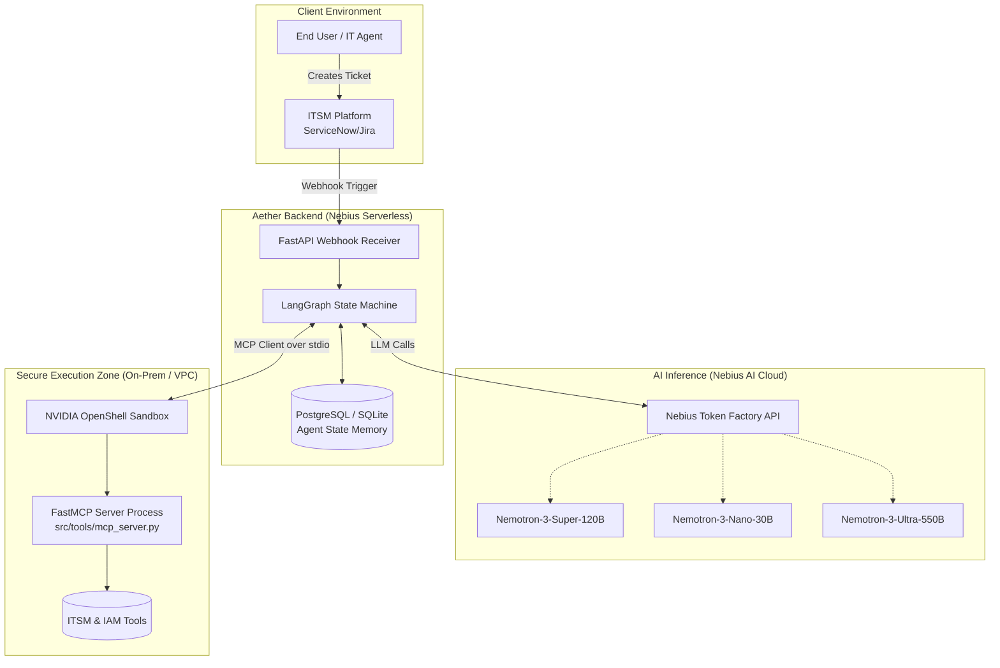
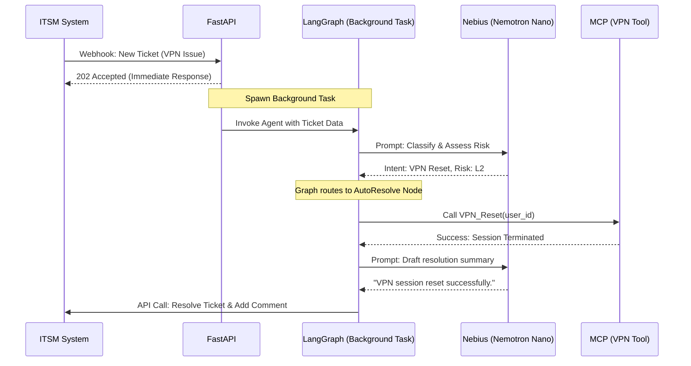
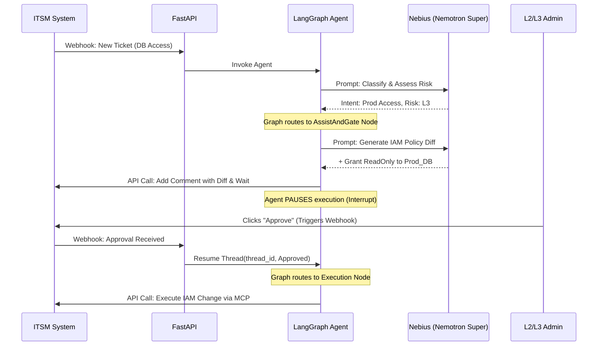

# System Architecture & Technical Flow (Aether ITSM)

## 1. Introduction
This document defines the technical architecture, component interactions, and data flows for Aether ITSM. It serves as the blueprint for development, ensuring all engineering efforts align with the "Autonomy Cascade" security model and utilize the Nebius Token Factory ecosystem effectively.

> **Implementation status** (reviewed against the code on 2026-09-26, roadmap 1.3). The
> diagrams in §2-§3 are the *target* design. What differs today:
> - **Implemented:** FastAPI webhook (202) → durable job queue in the same database
>   (`src/jobs/`, not `BackgroundTasks`) → LangGraph graph (§4) with a checkpointer that is
>   Postgres or SQLite (`src/agents/runtime/checkpointer.py`); MCP tools over stdio; employee chat
>   (Concierge) with RAG, repo reading, read-only platform logs and screenshot reading by a
>   vision model; GitHub issues on escalation; Alembic migrations; Docker Compose stack.
> - **Planned:** ITSM API calls back into Jira/ServiceNow (comment, resolve, approve there);
>   NVIDIA OpenShell sandbox; hosting on Nebius Serverless; Nemotron-3 Nano/Super/Ultra ids
>   (the configured Nebius ids are placeholders and there is no Ultra role).
> - **Simulated:** the VPN/MDM/IAM/knowledge MCP tool backends (canned results).

## 2. High-Level System Architecture

Aether operates as an intelligent middleware layer between the ITSM Platform (e.g., ServiceNow/Jira) and the organization's infrastructure.


```mermaid
graph TD
    subgraph "Client Environment"
        User[End User / IT Agent]
        ITSM[ITSM Platform<br/>ServiceNow/Jira]
    end

    subgraph "Aether Backend (Nebius Serverless)"
        WebhookAPI[FastAPI Webhook Receiver]
        Graph[LangGraph State Machine]
        DB[(PostgreSQL / SQLite<br/>Agent State Memory)]
    end

    subgraph "AI Inference (Nebius AI Cloud)"
        TF[Nebius Token Factory API]
        Super[Nemotron-3-Super-120B]
        Nano[Nemotron-3-Nano-30B]
        Ultra[Nemotron-3-Ultra-550B]
    end

    subgraph "Secure Execution Zone (On-Prem / VPC)"
        OpenShell[NVIDIA OpenShell Sandbox]
        MCPServer[FastMCP Server Process<br/>src/tools/mcp_server.py]
        Tools[(ITSM & IAM Tools)]
    end

    User -->|Creates Ticket| ITSM
    ITSM -->|Webhook Trigger| WebhookAPI
    WebhookAPI --> Graph
    Graph <--> DB
    Graph <-->|LLM Calls| TF
    TF -.-> Super & Nano & Ultra
    
    Graph <-->|MCP Client over stdio| OpenShell
    OpenShell --> MCPServer
    MCPServer --> Tools
```

## 3. Detailed Data Flows

### 3.1 Scenario A: Low-Risk Auto-Resolution (Level 2)
*Example: A user requests a VPN session reset.*


```mermaid
sequenceDiagram
    participant ITSM as ITSM System
    participant API as FastAPI
    participant Graph as LangGraph (Background Task)
    participant LLM as Nebius (Nemotron Nano)
    participant MCP as MCP (VPN Tool)

    ITSM->>API: Webhook: New Ticket (VPN Issue)
    API-->>ITSM: 202 Accepted (Immediate Response)
    Note over API, Graph: Spawn Background Task
    
    API->>Graph: Invoke Agent with Ticket Data
    Graph->>LLM: Prompt: Classify & Assess Risk
    LLM-->>Graph: Intent: VPN Reset, Risk: L2
    
    Note over Graph: Graph routes to AutoResolve Node
    
    Graph->>MCP: Call VPN_Reset(user_id)
    MCP-->>Graph: Success: Session Terminated
    
    Graph->>LLM: Prompt: Draft resolution summary
    LLM-->>Graph: "VPN session reset successfully."
    
    Graph->>ITSM: API Call: Resolve Ticket & Add Comment
```

### 3.2 Scenario B: Medium-Risk Human-in-the-Loop (Level 3)
*Example: A user requests elevated access to a production database.*


```mermaid
sequenceDiagram
    participant ITSM as ITSM System
    participant API as FastAPI
    participant Graph as LangGraph Agent
    participant LLM as Nebius (Nemotron Super)
    participant Admin as L2/L3 Admin

    ITSM->>API: Webhook: New Ticket (DB Access)
    API->>Graph: Invoke Agent
    Graph->>LLM: Prompt: Classify & Assess Risk
    LLM-->>Graph: Intent: Prod Access, Risk: L3
    
    Note over Graph: Graph routes to AssistAndGate Node
    
    Graph->>LLM: Prompt: Generate IAM Policy Diff
    LLM-->>Graph: + Grant ReadOnly to Prod_DB
    
    Graph->>ITSM: API Call: Add Comment with Diff & Wait
    Note over Graph: Agent PAUSES execution (Interrupt)
    
    Admin->>ITSM: Clicks "Approve" (Triggers Webhook)
    ITSM->>API: Webhook: Approval Received
    API->>Graph: Resume Thread(thread_id, Approved)
    
    Note over Graph: Graph routes to Execution Node
    Graph->>ITSM: API Call: Execute IAM Change via MCP
```

## 4. LangGraph Node Specification

To achieve deterministic routing, we use LangGraph. The agent's memory (Thread State) is passed sequentially between nodes and persisted by the checkpointer (`AsyncPostgresSaver` when `DATABASE_URL` is Postgres, `AsyncSqliteSaver` otherwise) to survive server restarts during Human-in-the-Loop pauses. Ticket runs are queue jobs: a worker that dies mid-run is detected by heartbeat and the run resumes from the last completed node.

### 4.1 State Definition (Python / Pydantic)
```python
class AgentState(TypedDict):
    messages: Annotated[Sequence[BaseMessage], operator.add]
    ticket_id: str
    user_context: dict
    assessed_risk: int  # 0 to 4
    proposed_plan: Optional[str]
    human_approved: bool
```

### 4.2 Core Nodes
Implemented node names (`src/agents/ticket_flow/nodes/`, one module per node; wiring in `src/agents/ticket_flow/graph.py`) differ slightly from the original naming above — this reflects the actual graph:
1.  **`supervisor` node:** Calls the "nano" model. Reads the ticket and assigns `assessed_risk` (0-4), then `enforce_risk_floor()` (`src/agents/ticket_flow/risk_policy.py`) raises it further if the text matches a hardcoded high-risk pattern (IAM, production DB, firewall) — this floor exists precisely because the model's own classification isn't trusted as the final word. Routes to `policy`, `execution`, or `escalate`.
2.  **`policy` node:** Reached for Risk 1-3. Calls the "super" model against the tenant's `company_policy` RAG documents to decide `is_compliant`. Routes to `execution` (Risk 0-2, compliant), `draft_plan` (Risk 3, compliant), or `escalate` (non-compliant).
3.  **`execution` node:** Reached for Risk 0-2, or after a Risk 3 plan is approved. Calls the "super" model against `technical_repo`/`ai_feedback` RAG, and dispatches a real tool call through the MCP client (`src/tools/mcp_client.py`) when `tool_name` is set in its structured output — never free-form code, never a narrated-only "as if" execution.
4.  **`draft_plan` node:** Reached for Risk 3 (compliant). Drafts `proposed_plan` and the graph pauses (`interrupt_after=["draft_plan"]`) until `POST /api/approve/{ticket_id}` resumes it. On approval it proceeds to `execution` with the approved plan in context; on rejection it routes to `escalate` instead of dead-ending.
5.  **`escalate` node:** Reached for Risk 4, non-compliant requests, a rejected plan, or any node-level technical failure. Produces the escalation summary; the orchestration layer (not the graph itself) then enqueues a `create_github_issue` job (`src/services/ticket_runs.py`) that opens a GitHub Issue for the engineering team if the tenant has GitHub configured (`src/integrations/github.py`), with retries, and records the link on the ticket.

Attached images never enter the graph as images: `src/agents/runtime/vision.py` reads them into text before the first node (webhook tickets and chat alike), so every node and every deterministic check works on plain text.

There is no `human_interrupt_node` as a separate graph node — the pause is `interrupt_after` on `draft_plan` itself, and no Nemotron-Ultra / deep-log-analysis step exists yet for `escalate`; it's the same "super" model doing what `policy`/`execution` do.

### 4.3 Employee chat: Concierge with an investigation supervisor — Implemented (Fase 16)
One chat turn is its own small LangGraph graph (`src/agents/concierge/node.py`):

```
START -> plan -> investigate -> [replan -> investigate] -> respond -> END
```

- **plan:** the deterministic floor (regex rules: outage wording, code/folder questions) plus what the supervisor model (`supervisor.py`, the "super" model — the 1B model added nothing in the eval) adds from a closed menu of read-only checks; `plan.py` validates every parameter against the tenant's configuration. Skipped for small talk and for tenants with nothing configured.
- **investigate:** workers (`workers.py`) run the plan with injected readers (`ConciergeSources`): knowledge base, code search and repo layout concurrently, then the platform diagnosis per service (verdict + stack trace → `file:line`), then the files the findings point at.
- **replan (once, within budget):** when a failing service left no code location, the supervisor may pick files from candidates built by code (e.g. `POST /api/cart/add 500` → `cartController.js`, `cartService.js`).
- **respond:** the answer from the evidence, the deterministic rules (verdict line, "🔍 Revisé ..." line, an application failure always becomes a ticket), validated citations.

Evidence lives in an in-process per-turn workspace; the checkpoint keeps only small investigation records. Measured with `python -m evals.run --suite diagnosis` (fixture tenant: the real `core-ecommerce-api` repo and Render-shaped logs over mocked HTTP).

### 4.4 Incident → engineering → fix proposal → notification — Implemented (Fase 16)
An unresolved turn with a failing service opens a ticket that stores the incident as structured data. The ticket flow routes it to `escalate` deterministically (`nodes/supervisor.py`), the outbox enqueues the GitHub issue, and, for tenants that opted in, the issue job enqueues `propose_code_fix`: one validated edit to the failing line (`src/agents/code_fix/`) committed to a new `aether/fix-*` branch and opened as a draft pull request (`src/integrations/github.py`). Every status change notifies the requester in the portal (`notifications` table, `GET /api/me/notifications`); an engineer closes the ticket after merging (`POST /api/tenant/tickets/{id}/resolve`), which notifies again. Guard rails: `docs/security_guardrails.md` §3.4.

### 4.5 Knowledge base (RAG) — Implemented (Fase 14)
- **Ingest:** upload → validation (`ingest_guard.py`) → parsing (`parsing.py`: PDF headings by font size, tables as Markdown, scanned pages reported) → a new *version* of the document is registered and an `index_document` job queued in the same transaction. The worker chunks by section, redacts secrets, flags injection-like text, embeds in batches and flips the active version atomically; the previous version answers until then (`documents.py`).
- **Store:** `knowledge_documents` / `knowledge_chunks` with `tenant_id` as a column, RLS on both, a dimensionless `vector` column with one partial HNSW index per embedding model (vectors of different models are never compared), and a GIN full-text index (`store.py`).
- **Retrieve:** follow-up rewriting (`query.py`) → dense + BM25 + exact-identifier candidates → Reciprocal Rank Fusion → cross-encoder rerank (optional, `rerank.py`) → relevance gate → small-to-big merge → numbered passages (`retrieval.py`). The Concierge does one search over policies and technical docs; ticket nodes search their own source.
- **Answer:** citations validated by code, plus evidence-based attribution (`citations.py`); the chat API returns only the sources the answer used.
- **Observe:** a `retrieval` span per search (stage timings, chunk ids/scores) and a `rag_queries` row feeding the admin insights (`insights.py`).
- **Measure:** `evals/rag` (74 queries, 2-tenant corpus); every default above was chosen with it — see `docs/PLAN_IMPLEMENTACION.txt`, Fase 14.

## 5. Security & Infrastructure Deployment

### 5.1 Nebius Token Factory Routing
We will use the OpenAI-compatible SDK to interact with Nebius.
*   **Base URL:** `https://api.studio.nebius.ai/v1/`
*   Model routing is handled at the LangGraph node level by passing different `model_name` strings depending on the required cognitive load.

### 5.2 NVIDIA OpenShell & FastMCP
**Implemented today:** all tools are hosted by a standalone MCP server (`src/tools/mcp_server.py`, built on `mcp.server.mcpserver.MCPServer` — the `mcp>=2.0` successor to the older `FastMCP` class). LangGraph does not import these tools directly; `src/tools/mcp_client.py` connects to the server as an MCP client over `stdio`, one long-lived connection per app process (opened in FastAPI's `lifespan`, see `src/main.py`), not spawned per ticket.

**Not implemented yet:** the OpenShell sandboxing described below. The server process today is a plain local subprocess with no network/filesystem/process isolation enforced — see `docs/security_guardrails.md` §3.1 for the current risk assessment of that gap.
*   **Process Isolation:** MCP server runs as an independent subprocess (true today — but "independent" ≠ "sandboxed"; it can still make arbitrary syscalls).
*   **Network Policy (target, not enforced):** Only allow outbound connections to specifically whitelisted internal APIs (e.g., Jira, internal AD).
*   **Filesystem Policy (target, not enforced):** Read-only access to `/etc/configs`, ephemeral read/write to `/tmp/agent_workspace`.
